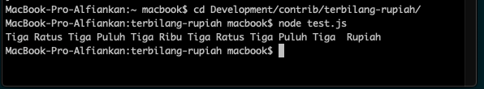

NPM Node Module terbilang rupiah

> Mengubah angka rupiah menjadi kalimat terbilang, biasanya digunakan untuk struk pembayaran

> Install :

    

> Simple Usage :

`const terbilang = require('./index');`
`console.log(terbilang(333333));`

> Result : 
 

 
